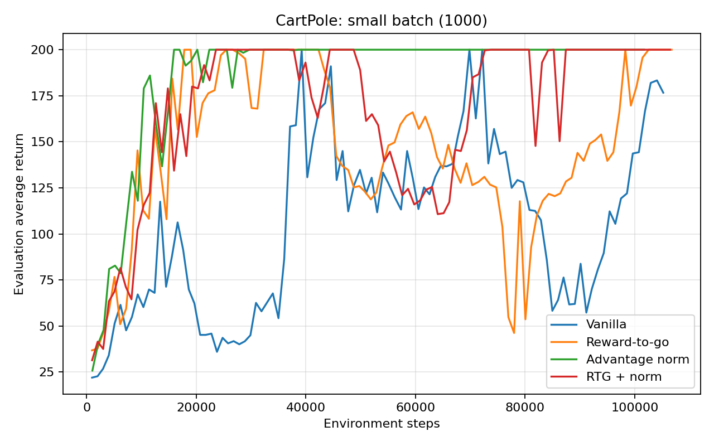
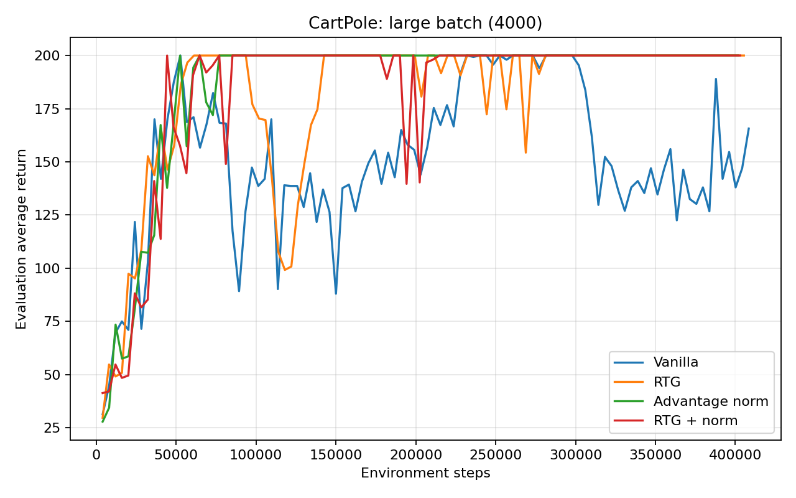
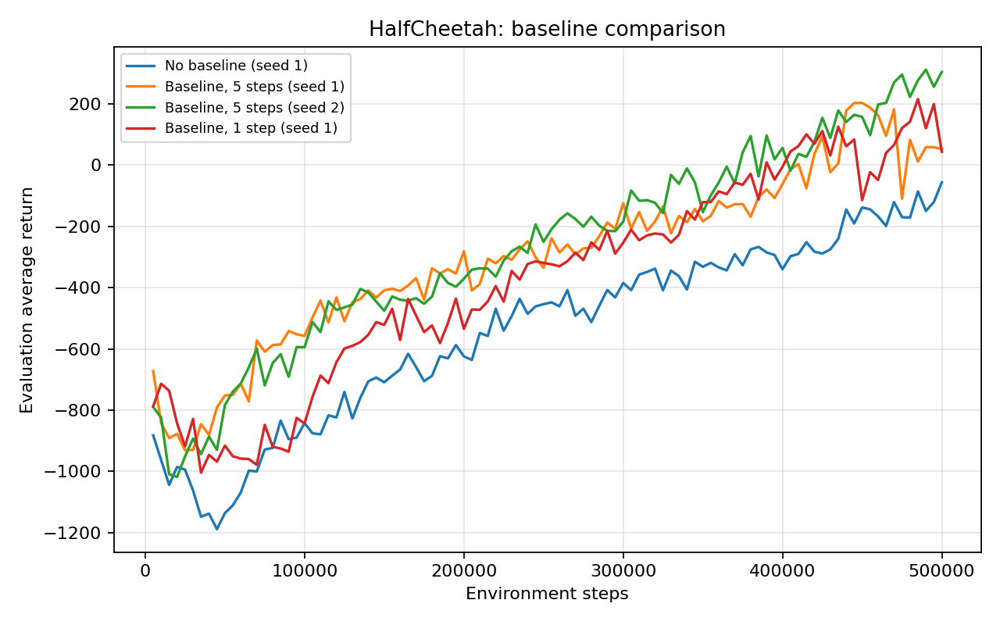
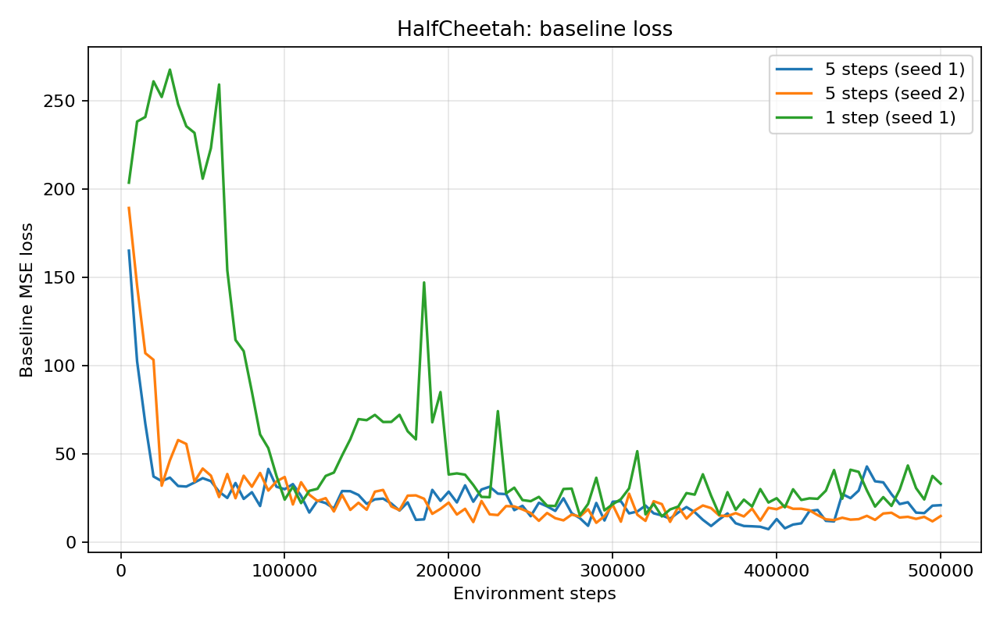
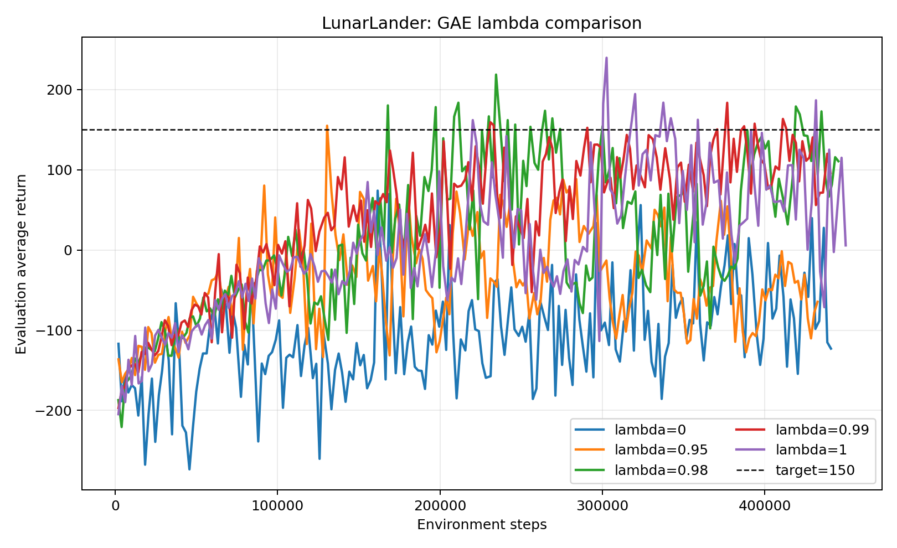
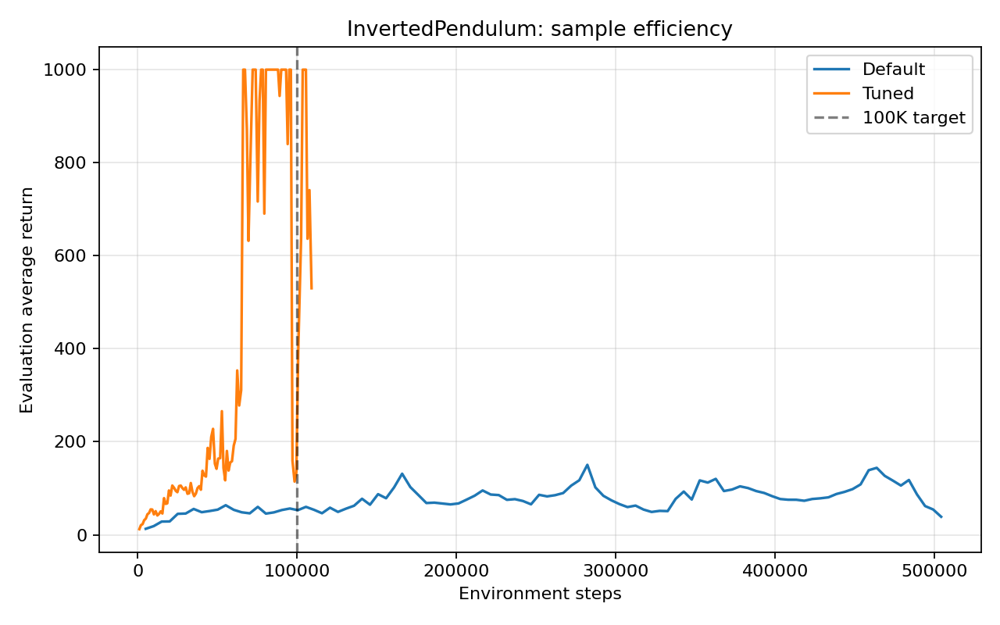

# CS 285 HW2：Policy Gradient 项目报告

## 1. 项目概述

本项目实现了基础策略梯度算法，并在 CartPole、HalfCheetah、LunarLander 和 InvertedPendulum 四个 Gym 环境中验证以下方法：

- trajectory-centric return 与 reward-to-go；
- advantage normalization；
- 神经网络 value baseline；
- Generalized Advantage Estimation（GAE）；
- 连续动作与离散动作的随机策略。

所有实验均在本地 Windows 机器的 CPU 上完成。实验环境使用 Python 3.10、PyTorch 2.9.1+cpu；torch.cuda.is_available() 为 False，因此没有使用云端或 GPU 训练。完整逐轮日志和模型保存在 exp/，报告图片保存在 report_assets/。

## 2. 代码实现

### 2.1 轨迹采样

src/infrastructure/utils.py 中的 sample_trajectory 完成了完整 rollout：

1. 将当前 observation 输入策略并采样 action；
2. 调用 env.step(action) 得到下一个状态、奖励和环境终止标志；
3. 同时检查环境终止和最大 episode 长度；
4. 保存 observation、action、reward、next observation 和 terminal；
5. sample_trajectories 持续采样完整轨迹，直到总步数不少于指定 batch size。

### 2.2 随机策略与策略梯度

src/networks/policies.py 同时支持两类动作空间：

- 离散动作：网络输出 logits，并构造 Categorical 分布；
- 连续动作：网络输出均值，另行学习 log standard deviation，并构造 Normal 分布。

策略损失为：

$$
L_{actor}
=-\frac{1}{B}\sum_{t=1}^{B}
\log \pi_\theta(a_t\mid s_t)\hat A_t.
$$

连续动作的 log probability 会沿动作维度求和，使每个时间步只产生一个标量 log probability。更新过程执行清零梯度、反向传播和 optimizer step。

### 2.3 回报估计

src/agents/pg_agent.py 实现了两种 Q 值估计。

整条轨迹回报：

$$
\hat Q_t=\sum_{t'=0}^{H-1}\gamma^{t'}r_{t'}.
$$

同一轨迹中的每一个动作都使用同一个回报。

Reward-to-go：

$$
\hat Q_t=\sum_{t'=t}^{H-1}\gamma^{t'-t}r_{t'}.
$$

它只保留当前动作可能影响的未来奖励，排除了已经发生的过去奖励，因此通常具有更低的方差。

### 2.4 Value baseline 与 GAE

src/networks/critics.py 使用 MLP 预测状态价值，并用 Monte Carlo Q 值作为回归目标：

$$
L_{critic}=\frac{1}{B}\sum_t(V_\phi(s_t)-\hat Q_t)^2.
$$

不使用 GAE 时，优势为：

$$
\hat A_t=\hat Q_t-V_\phi(s_t).
$$

使用 GAE 时，先计算 TD residual：

$$
\delta_t=r_t+\gamma(1-d_t)V_\phi(s_{t+1})-V_\phi(s_t),
$$

再从后向前递推：

$$
\hat A_t=\delta_t+\gamma\lambda(1-d_t)\hat A_{t+1}.
$$

终止掩码防止优势跨越 episode 边界传播。若启用 advantage normalization，则将当前 batch 的优势标准化为均值 0、标准差 1。

### 2.5 训练循环

src/scripts/run.py 的每一轮训练依次完成：

1. 使用当前 on-policy 策略采集新的训练轨迹；
2. 展平 observation、action 和 terminal，同时保留逐轨迹 rewards；
3. 计算 Q 值和 advantage；
4. 更新 actor，并按 baseline_gradient_steps 更新 critic；
5. 采集独立评估轨迹，写入 CSV、W&B 日志和模型快照。

## 3. 验证

在正式训练前完成了以下检查：

- 所有 src Python 文件通过 compileall；
- 所有模块均可导入；
- 折扣回报测试：rewards = [1, 2, 3]、gamma = 0.9 时，整轨迹回报为 [5.23, 5.23, 5.23]；
- reward-to-go 测试结果为 [5.23, 4.70, 3.00]；
- GAE 单元测试确认 terminal 能正确截断不同 episode；
- 离散 actor 更新产生有限 loss；
- CartPole 五步 rollout 能正确记录 terminal；
- 源码中不再存在待填充的 TODO、空 pass 或占位 return None。

## 4. 实验一：CartPole

共同设置为 100 个训练 iteration、默认两层 64 单元 MLP、学习率 0.005、discount 1.0、seed 1。评价指标为 Eval_AverageReturn，横轴使用真实 Train_EnvstepsSoFar。

### 4.1 小 batch（每轮至少 1,000 步）

| 方法                      | 峰值回报 | 最终回报 | 首次达到 200 的环境步数 |
| ------------------------- | -------: | -------: | ----------------------: |
| 整轨迹回报                |      200 |  176.667 |                  39,239 |
| Reward-to-go              |      200 |      200 |                  17,821 |
| 整轨迹回报 + 优势归一化   |      200 |      200 |                  15,958 |
| Reward-to-go + 优势归一化 |      200 |      200 |                  23,607 |

### 4.2 大 batch（每轮至少 4,000 步）

| 方法                      | 峰值回报 | 最终回报 | 首次达到 200 的环境步数 |
| ------------------------- | -------: | -------: | ----------------------: |
| 整轨迹回报                |      200 |  165.667 |                  52,666 |
| Reward-to-go              |      200 |      200 |                  61,221 |
| 整轨迹回报 + 优势归一化   |      200 |      200 |                  52,499 |
| Reward-to-go + 优势归一化 |      200 |      200 |                  44,371 |

### 4.3 结果分析

不使用优势归一化时，小 batch 的 reward-to-go 明显快于整轨迹回报：分别在 17,821 和 39,239 步首次达到 200，而且 reward-to-go 的最终结果保持在 200。其原因是过去奖励不可能由当前动作改变；reward-to-go 去除了这部分无关噪声，使梯度估计更符合因果关系。

优势归一化总体改善了稳定性。小 batch 中，整轨迹回报加归一化最快达到 200；所有带归一化的配置最终均为 200。大 batch 的曲线更平滑，但每次更新需要四倍左右的交互数据，因此按环境步数衡量并不必然更高效。

实际命令：

    uv run src/scripts/run.py --env_name CartPole-v0 -n 100 -b 1000 --exp_name cartpole
    uv run src/scripts/run.py --env_name CartPole-v0 -n 100 -b 1000 -rtg --exp_name cartpole_rtg
    uv run src/scripts/run.py --env_name CartPole-v0 -n 100 -b 1000 -na --exp_name cartpole_na
    uv run src/scripts/run.py --env_name CartPole-v0 -n 100 -b 1000 -rtg -na --exp_name cartpole_rtg_na
    uv run src/scripts/run.py --env_name CartPole-v0 -n 100 -b 4000 --exp_name cartpole_lb
    uv run src/scripts/run.py --env_name CartPole-v0 -n 100 -b 4000 -rtg --exp_name cartpole_lb_rtg
    uv run src/scripts/run.py --env_name CartPole-v0 -n 100 -b 4000 -na --exp_name cartpole_lb_na
    uv run src/scripts/run.py --env_name CartPole-v0 -n 100 -b 4000 -rtg -na --exp_name cartpole_lb_rtg_na

## 5. 实验二：HalfCheetah 与 value baseline

共同设置为 100 iteration、每轮 5,000 个训练步、3,000 个评估步、reward-to-go、discount 0.95、actor 学习率 0.01。

| 配置                             | Seed | 峰值回报 | 最终回报 | 最终 baseline loss |
| -------------------------------- | ---: | -------: | -------: | -----------------: |
| 无 baseline                      |    1 |  -56.333 |  -56.333 |             不适用 |
| Baseline，5 critic steps         |    1 |  202.861 |   52.475 |             21.101 |
| Baseline，1 critic step          |    1 |  215.306 |   43.532 |             33.267 |
| Baseline，5 critic steps（重试） |    2 |  311.376 |  303.904 |             14.957 |

Value baseline 带来了非常明显的提升：同为 seed 1 时，无 baseline 的峰值只有 -56.333，而 baseline 版本达到 202.861。把每轮 critic 更新从 5 次减少到 1 次后，最终 baseline loss 从 21.101 上升到 33.267，说明 critic 拟合不足，策略最终表现也略差。

策略梯度具有较大的随机波动。seed 1 的 baseline run 没有达到作业要求，但完全相同的超参数在 seed 2 达到峰值 311.376，最终回报 303.904，满足最终平均回报超过 300 的目标。这也说明仅报告单个随机种子可能产生误导。

实际命令：

    uv run src/scripts/run.py --env_name HalfCheetah-v4 -n 100 -b 5000 -eb 3000 -rtg --discount 0.95 -lr 0.01 --exp_name cheetah
    uv run src/scripts/run.py --env_name HalfCheetah-v4 -n 100 -b 5000 -eb 3000 -rtg --discount 0.95 -lr 0.01 --use_baseline -blr 0.01 -bgs 5 --exp_name cheetah_baseline
    uv run src/scripts/run.py --env_name HalfCheetah-v4 -n 100 -b 5000 -eb 3000 -rtg --discount 0.95 -lr 0.01 --use_baseline -blr 0.01 -bgs 1 --exp_name cheetah_baseline_bgs1
    uv run src/scripts/run.py --env_name HalfCheetah-v4 -n 100 -b 5000 -eb 3000 -rtg --discount 0.95 -lr 0.01 --use_baseline -blr 0.01 -bgs 5 --seed 2 --exp_name cheetah_baseline

## 6. 实验三：LunarLander 与 GAE

五组实验除 lambda 外使用完全相同的设置：200 iteration、每轮 2,000 个训练步和 2,000 个评估步、三层 128 单元 MLP、学习率 0.001、discount 0.99、reward-to-go 和 value baseline。

| GAE lambda | 峰值回报 | 最终回报 | 首次超过 150 的环境步数 |
| ---------: | -------: | -------: | ----------------------: |
|          0 |   74.015 | -122.966 |                  未达到 |
|       0.95 |  154.946 |  -64.508 |                 130,516 |
|       0.98 |  218.676 |  110.693 |                 167,939 |
|       0.99 |  183.505 |   95.845 |                 231,071 |
|          1 |  239.633 |    5.716 |                 220,201 |

lambda = 0 等价于一步 TD advantage，方差低但偏差大，并且非常依赖 critic 的准确性。本次实验中它从未超过 150，是五组中最差的配置。lambda = 1 接近 Monte Carlo advantage，偏差较低但方差较高；它取得最高峰值 239.633，同时曲线和最终值波动也很大。

中间值在两者之间折中。lambda = 0.95 最早跨过 150，但随后退化；lambda = 0.98 达到 218.676 且最终回报 110.693，是本次单 seed 实验中综合表现最好的配置；lambda = 0.99 也超过了目标。曲线说明“曾达到目标”不等于训练后稳定保持目标，报告峰值、最终值和完整曲线缺一不可。

实际命令模板如下，其中 L 分别替换为 0、0.95、0.98、0.99 和 1：

    uv run src/scripts/run.py --env_name LunarLander-v2 --ep_len 1000 --discount 0.99 -n 200 -b 2000 -eb 2000 -l 3 -s 128 -lr 0.001 --use_reward_to_go --use_baseline --gae_lambda L --exp_name lunar_lander_lambdaL

## 7. 实验四：InvertedPendulum 调参

| 配置     | 峰值回报 | 最终回报 | 总环境步数 | 首次达到 1000 的环境步数 |
| -------- | -------: | -------: | ---------: | -----------------------: |
| 默认配置 |  150.429 |   38.808 |    504,178 |                   未达到 |
| 调优配置 |     1000 |      530 |    109,081 |                   66,194 |

调优配置把每轮 batch size 从 5,000 降到 1,000，并启用了 reward-to-go 和 advantage normalization，同时把 discount 设为 0.99。它在 66,194 个环境步时首次达到满分 1000，满足少于 100,000 步的样本效率要求。后期回报下降说明朴素 policy gradient 仍可能用一次不理想的 on-policy batch 把已经较好的策略更新坏；作业目标关注首次达到满分所需的环境交互量，因此该配置达标。

实际命令：

    uv run src/scripts/run.py --env_name InvertedPendulum-v4 -n 100 -b 5000 -eb 1000 --exp_name pendulum
    uv run src/scripts/run.py --env_name InvertedPendulum-v4 -n 100 -b 1000 -eb 1000 -rtg -na --discount 0.99 -lr 0.005 --exp_name pendulum_tuned

## 8. 总结

本项目已经补齐策略采样、离散与连续策略、策略梯度损失、两种回报估计、value baseline、GAE 和完整训练循环。实验结果支持以下结论：

- reward-to-go 通常比整轨迹回报具有更好的样本效率；
- 优势归一化能显著改善简单环境中的优化稳定性；
- value baseline 能有效降低方差，但 critic 需要足够的更新次数；
- GAE 的 lambda 控制偏差—方差权衡，过低的 lambda 可能因 critic 误差导致严重偏差；
- 策略梯度结果具有较强随机性，完整曲线、随机种子、峰值和最终值都应一并报告。

本次训练已达到作业的关键性能要求：

- CartPole 的小 batch 与大 batch 最佳配置都达到回报 200；
- HalfCheetah baseline 的最终平均回报达到 303.904；
- LunarLander 最佳 run 的峰值达到 239.633，超过 150；
- InvertedPendulum 在 66,194 个环境步达到满分 1000。

## 9. 局限性

除 HalfCheetah 的达标重试外，大多数配置只运行了一个随机种子，因此这些数值不能替代多随机种子的均值与置信区间。LunarLander 和 InvertedPendulum 后期存在明显回撤，说明当前朴素策略梯度实现能达到目标，但不保证单调改进。更正式的研究应增加多个随机种子，并报告均值、标准差或置信区间。
